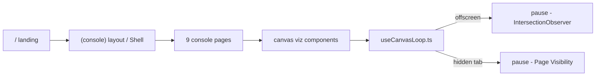

```
 ██████╗ ██╗      █████╗  ██████╗██╗  ██╗███████╗██╗████████╗███████╗
 ██╔══██╗██║     ██╔══██╗██╔════╝██║ ██╔╝██╔════╝██║╚══██╔══╝██╔════╝
 ██████╔╝██║     ███████║██║     █████╔╝ ███████╗██║   ██║   █████╗
 ██╔══██╗██║     ██╔══██║██║     ██╔═██╗ ╚════██║██║   ██║   ██╔══╝
 ██████╔╝███████╗██║  ██║╚██████╗██║  ██╗███████║██║   ██║   ███████╗
 ╚═════╝ ╚══════╝╚═╝  ╚═╝ ╚═════╝╚═╝  ╚═╝╚══════╝╚═╝   ╚═╝   ╚══════╝
```

<div align="center">

### `INTRUSION OPS CONSOLE // SEE THE NETWORK. OWN THE NODE.`

*a monochrome hacking dashboard where every node, orbit, and strike is drawn by hand and backed by absolutely nothing*


-888888?style=flat-square&labelColor=111111)
-888888?style=flat-square&labelColor=111111)

</div>

---

## 🖤 What is this

BLACKSITE is the hacker command center from a movie that was never made. Force-directed network graphs, targets orbiting a C2 sun like planets, a 360° threat radar, a kill-chain that marches itself through seven phases, ciphers that resolve out of glyph noise, and a terminal you can actually type into. It is a data-viz piece dressed as an intrusion console — monochrome, terminal-flavored, and built to make a portfolio reviewer stop scrolling.

There is no backend. There are no real systems. Every IP, hash, and "OWNED" tag is fabricated for effect, and the README is the only honest file in the repo. The entire visual layer is hand-drawn on `<canvas>` with zero charting libraries — every sweep, arc, and gauge is raw 2D context and `requestAnimationFrame`.

It also tries very hard not to melt your laptop, which is more than most hacker dashboards can say.

```console
nick@next-app:~$ npm run dev
[✓] 10 pages · 9 canvas loops · 0 real systems harmed
[i] every figure is fabricated. the fans stay quiet offscreen.
```

## 🛰️ The console

| | view | what it actually does |
|---|---|---|
| 01 | **landing** | boot sequence types itself out over a drifting starfield, then `ENTER CONSOLE` |
| 02 | **overview** | kpi cards, live sparklines, event feed, target progress bars — the "we're winning" screen |
| 03 | **net graph** | force-directed host map with springs, repulsion, traveling packets — click a node to inspect |
| 04 | **target orbit** | the engagement as a solar system: C2 is the sun, targets orbit by access difficulty, moons are dependent services |
| 05 | **attack map** | dotted-continent world with arcing strikes, impact rings, and a live strike ticker |
| 06 | **kill chain** | seven intrusion phases that auto-advance forever, pulsing the active stage |
| 07 | **threat radar** | 360° PPI sweep — contacts brighten as the beam passes, then fade with age |
| 08 | **telemetry** | animated line/bar charts and radial gauges, streaming at a convincing 1Hz |
| 09 | **decrypt** | glyphs scramble and resolve into "recovered" plaintext, left to right (none of it real) |
| 10 | **shell** | an interactive sandboxed terminal — `scan`, `hosts`, `exploit <host>`, `loot`, ↑/↓ history |

## 🚀 Run it

Needs Node 18+. No env vars, no services, no keys — nothing to configure.

```bash
git clone https://github.com/nitrimandylis/next-app.git
cd next-app
npm install
npm run dev
```

Open <http://localhost:3000>, hit `ENTER CONSOLE`, and pretend you're in a server room at 3am. Deploy with `vercel` whenever you want it shareable — it's a static prerender, so it costs roughly nothing to host.

## 🔩 Under the hood



| layer | path | job |
|---|---|---|
| design system | `app/globals.css` | the entire monochrome look — css vars, grid, scanlines, no tailwind |
| app shell | `app/components/Shell.tsx` | sidebar nav, breadcrumb, live UTC clock for the 9 console pages |
| loop driver | `app/components/useCanvasLoop.ts` | every canvas runs through this — pauses offscreen + on hidden tabs, respects reduced-motion |
| viz | `app/components/*.tsx` | NodeGraph, SolarMap, AttackMap, Radar, BigChart, Gauge, Sparkline, KillChain, Decrypt |
| share card | `app/opengraph-image.tsx` | dynamic monochrome OG image so links don't unfurl into a void |

**Stack:** Next.js 16 (App Router) · React 19 · TypeScript · raw Canvas 2D · CSS Modules · zero runtime UI deps

---

<div align="center">

**[Nick Trimandylis](https://github.com/nitrimandylis)**

`ALL DATA FABRICATED — THE CRAFT IS REAL`

</div>
